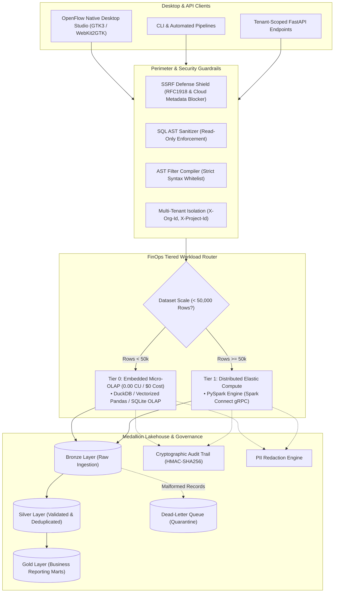

# OpenFlow — Modern Fabric ELT Platform & Lakehouse Studio

[](https://www.python.org/downloads/)
[-brightgreen.svg)](tests/)
[](docs/FABRIC_AND_GOVERNANCE.md)
[](docs/UI_AND_ANALYTICS.md)
[](LICENSE)

**OpenFlow** is an enterprise-grade transformation platform, economic capacity router, and Medallion Lakehouse studio. It combines the interactive flexibility of local analytical engines (DuckDB, Pandas, SQLite OLAP) with distributed cluster execution (PySpark via Spark Connect), wrapped in an **all-local native desktop studio (GTK3 / WebKit2GTK)** and protected by a robust SSRF defense shield and cryptographic audit engine.

---

## Architecture Overview



---

## Five Foundational Engineering Standards

OpenFlow is strictly engineered under five immutable architecture principles:

1. **Test-Driven Development (TDD)**: Every engine feature, AST filter, and security filter is developed test-first. The platform maintains a **100% green test suite** with 64 automated unit and integration tests.
2. **Idempotency**: All pipeline operations, SQL transformations, and Medallion state transitions produce deterministic outcomes. Duplicate uploads are rejected via SHA-256 content hashes, and outputs use atomic swap semantics (`if_exists="replace"`).
3. **Resiliency**: Remote storage connectors (AWS S3, Azure ADLS Gen2, Google Cloud Storage, JDBC) execute with exponential backoff and randomized jitter, protected by automatic circuit breakers and socket re-connection.
4. **Fault-Tolerance**: Malformed rows or corrupted schemas are isolated and routed to Dead-Letter Queues (DLQ) with error diagnostics, preventing batch pipeline crashes. Intermediate states use atomic staging directories to ensure zero partial writes.
5. **Economic Capacity & ROI (FinOps)**: Datasets under 50,000 rows automatically route to **Tier 0 Embedded Compute** at **0.00 Capacity Units (CU)** and **$0 cloud cost**, reserving distributed PySpark clusters only for heavy shuffles. Compressed columnar Parquet storage reduces I/O by 80-90%.

---

## Key Features

### 1. All-Local Native Desktop Studio (Zero Remote Dependencies)
- **Linux GTK3 + WebKit2GTK Runner**: Runs as a standalone desktop window without browser tabs or address bars. Gracefully falls back to headless mode for CI/SSH environments.
- **100% Offline Air-Gapped Operation**: Completely stripped of all external CDNs (`cdnjs`, `jsdelivr`, `tailwindcss.com`).
- **VS Code Dark+ Industrial Aesthetic**: Pure local stylesheet matching authentic editor tones (`#1e1e1e`, `#252526`, `#007acc`, `#238636`) with 0px sharp geometry and zero emojis.
- **Embedded Code Editor**: Built-in syntax highlighting for SQL and PySpark with indentation support and keyboard shortcuts:
  - `F5` or `Ctrl + Enter`: Execute transformation pipeline.
  - `Tab`: 4-space code indentation.

### 2. Multi-Engine Analytics Suite
OpenFlow provides a unified visualization engine (`POST /api/v1/analytics/plot`) supporting:
- **Plotly (`plotly`)**: Interactive, zoomable charts with rich hover tooltips and dynamic inspection.
- **Seaborn (`seaborn`)**: Publication-grade statistical distributions, regression trends, and boxplots rendered as crisp vector SVGs.
- **Matplotlib (`matplotlib`)**: Industrial dark-theme vector charts, bar plots, and histograms rendered with backend isolation (`Agg`).
- **Native Vector Canvas (`vector`)**: Instant local HTML5 Canvas rendering for zero-latency in-memory previews.

### 3. Microsoft Fabric-Inspired Economic Capacity Router (FinOps)
- Automatically routes workloads based on row counts and complexity.
- Meters compute duration, memory footprint, and Capacity Units (CU).
- Returns actionable FinOps telemetry and estimated cloud cost savings with every job.

### 4. Medallion Lakehouse Lifecycle & Quarantine (DLQ)
- Formal **Bronze $\rightarrow$ Silver $\rightarrow$ Gold** data progression.
- Bad records and schema violations are cleanly quarantined into Dead-Letter Queues without aborting healthy records.

### 5. Enterprise Security & Governance
- **SSRF Defense Shield**: Prohibits requests to loopback interfaces, private RFC1918 subnets, and cloud instance metadata services (`169.254.169.254`).
- **SQL AST Sanitizer**: Permits only read-only queries (`SELECT`, `WITH`), rejecting destructive operations (`DROP`, `DELETE`, `TRUNCATE`, `ALTER`).
- **Cryptographic Audit Lineage**: Generates tamper-verifiable manifests signed with `HMAC-SHA256(InputHash || OutputHash || CodeHash)`.
- **Automated PII Redaction**: Automatically masks emails, phone numbers, and sensitive identity tokens.

---

## Quickstart

### Prerequisites
- Python 3.11 or 3.12
- Linux (Ubuntu/Debian) with `libwebkit2gtk-4.1-0` (for native desktop window)

### Installation
```bash
# Clone the repository
git clone https://github.com/MorphosML/lightweight_transformations_plataform.git
cd lightweight_transformations_plataform

# Create and activate virtual environment
python3 -m venv .venv
source .venv/bin/activate

# Install with all dependencies (API, PySpark, UI, and Test suites)
pip install -e '.[all]'
```

### Running the Application

#### A. Launch Native Desktop Studio
```bash
python run_ui.py
# or
python -m openflow_ui
```

#### B. Launch in Standalone Browser App Mode
If your Linux environment restricts WebKit2GTK bubblewrap sandboxing or GPU compositing:
```bash
python run_ui.py --browser
```

#### C. Launch in Headless Server Mode (Browser Access)
```bash
python run_ui.py --headless --port 8765
```
Open your browser to `http://localhost:8765`.

#### D. Running with Docker Compose
Run the distributed stack including Spark Master, Spark Worker, PostgreSQL, Redis, FastAPI, and Celery:
```bash
docker compose up --build
```
- **FastAPI Documentation**: [http://localhost:8000/docs](http://localhost:8000/docs)
- **Spark Master UI**: [http://localhost:8080](http://localhost:8080)
- **Spark Connect gRPC**: `sc://localhost:15002`

---

## Running the Automated Test Suite

OpenFlow is strictly validated with automated test suites:

```bash
# Run the complete test suite
.venv/bin/pytest tests/ -v
```

**Results**: 65 passing tests across all components:
- `test_analytics.py`: Plotly, Seaborn, Matplotlib, and statistical summaries.
- `test_ui.py`: Local desktop studio, headless fallback, and REST handlers.
- `test_fabric_and_governance.py`: Capacity router, FinOps metering, PII masking, audit lineage.
- `test_security_and_connectors.py`: SSRF shield, SQL sanitizer, S3 path isolation.
- `test_pyspark_engine.py`: Spark Connect configuration and distributed execution.
- `test_ast_compiler.py`: Abstract Syntax Tree whitelisting and RCE prevention.
- `test_engine.py`: Kahn's DAG topological sort and cycle validation.

---

## Detailed Documentation

For deep technical specifications, consult the dedicated documentation:
- 📖 [**Architecture Guide**](docs/ARCHITECTURE.md) — System topology, 5 core rules, AST compiler, and DAG engine.
- 💰 [**Fabric Capacity & Data Governance**](docs/FABRIC_AND_GOVERNANCE.md) — FinOps CU formulation, Medallion lifecycle, and PII masking.
- 🖥️ [**Desktop Studio & Analytics Guide**](docs/UI_AND_ANALYTICS.md) — GTK3/WebKit2 native runner, Plotly/Seaborn/Matplotlib suite, and keyboard shortcuts.

---

## License

This project is licensed under the MIT License — see the [LICENSE](LICENSE) file for details.
