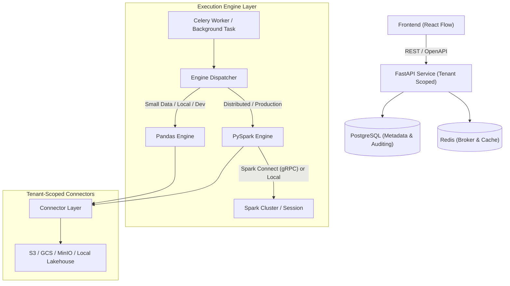

# OpenFlow ELT Platform

A high-performance, multi-tenant DAG transformation and execution platform with native **PySpark** cluster connectivity, lightweight local Pandas/Polars execution, AST-validated safe filter expressions, and production-hardened infrastructure.

---

## Architecture Overview



---

## Key Features & Review Resolutions

1. **PySpark & Distributed Execution**:
   - Pluggable `PySparkPipelineRunner` and `SparkSessionManager` supporting both **Spark Connect** (`sc://host:15002`) over gRPC and local/standalone Spark sessions.
   - Lazy DAG transformation and distributed joins, unions, and filters on large datasets without driver OOM cliffs.
2. **Safe Filter AST Compiler (S1)**:
   - Full protection against arbitrary code execution (RCE).
   - Validates expressions against a strict AST whitelist and compiles to both Pandas boolean Series and PySpark `Column` expressions (`F.col("price") > 100 & (F.col("status") == "active")`).
3. **Multi-Input DAG with Port Semantics (R1 & R2)**:
   - Supports multi-input nodes (e.g. `JoinNode` with `left` and `right` handles, `UnionNode` with N inputs).
   - Kahn's topological sort with cycle detection (`CycleError`) validated both at runtime and on pipeline schema creation.
4. **Tenant Isolation & Scoped Connectors (S2, S3, A1)**:
   - All storage paths use scoped object keys: `{tenant_id}/{project_id}/{key}`, rejecting traversal attempts (`..`).
   - Tenant isolation enforced across database models and API dependencies (`X-Org-Id`, `X-Project-Id`).
5. **Per-Node Observability & Bounded Preview (R3, A6)**:
   - Step-level execution telemetry (status, duration, row counts, and partial error logs).
   - Safe `/preview` endpoint executing only upstream dependencies and truncating outputs via `.limit(100)` or `.head(100)`.
6. **Hardened Secrets & Authenticated Encryption (A5)**:
   - Authenticated Fernet symmetric encryption (AES-128-CBC + HMAC-SHA256) with environment key injection (`FERNET_KEY`).
7. **CI/CD & Docker Infrastructure (M3, M4)**:
   - Modern GitHub Actions CI/CD (`.github/workflows/ci.yml`) with Python 3.12, Java 17 for Spark, Ruff linting, Bandit security scanning, and live PostgreSQL & Redis test services.
   - Production `docker-compose.yml` with healthchecks (`service_healthy`), Spark Master with Spark Connect enabled, Spark Worker, PostgreSQL, Redis, API, and Celery Worker.

---

## Getting Started

### Local Setup & Testing

```bash
# Clone the repository
git clone https://github.com/MorphosML/lightweight_transformations_plataform.git
cd lightweight_transformations_plataform

# Install dependencies (development & tests)
python3 -m venv .venv
source .venv/bin/activate
pip install -e '.[all]'

# Run the test suite
pytest -v
```

### Running with Docker Compose

Run the complete stack including PostgreSQL, Redis, Spark Master (with Spark Connect), Spark Worker, FastAPI, and Celery worker:

```bash
docker compose up --build
```

- **FastAPI Documentation**: [http://localhost:8000/docs](http://localhost:8000/docs)
- **Spark Web UI**: [http://localhost:8080](http://localhost:8080)
- **Spark Connect endpoint**: `sc://localhost:15002`

---

## License

MIT
