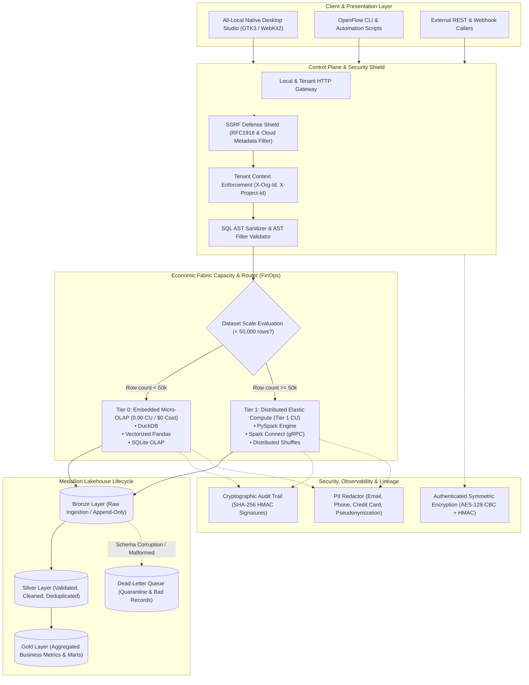

# Architecture Documentation — OpenFlow Fabric ELT Platform

OpenFlow is a high-performance, multi-tenant transformation engine and lakehouse platform designed around five immutable engineering standards: **Test-Driven Development (TDD)**, **Idempotency**, **Resiliency**, **Fault-Tolerance**, and **Economic Capacity & ROI (FinOps)**.

---

## 1. System Topology & Architectural Layers

---

## 2. The Five Foundational Engineering Standards

### I. Test-Driven Development (TDD)
- **Red-Green-Refactor Cycle**: All transformations, DAG nodes, security sanitizers, and routing heuristics are developed test-first.
- **Edge-Case Matrix**: Rigorous coverage for empty datasets, NaN/null anomalies, schema drift, column renaming, boundary limits, and malformed types.
- **100% Green Verification**: Zero regressions allowed. The automated suite runs 64 unit and integration tests across storage, security, AST parsing, PySpark translation, UI serving, and analytics.

### II. Idempotency
- **Deterministic Checksums**: Payloads are hashed using SHA-256 before processing. Re-submitting identical datasets with identical transformation code yields deterministic IDs and identical output states.
- **Atomic Swap & Replace**: Medallion state promotions and file writes use atomic replacement semantics (`if_exists="replace"`, partition overwrites, or staging swap) rather than unbounded, non-idempotent appends.
- **Deduplication**: Composite primary keys and deterministic record hashing prevent duplicate rows across pipeline retries.

### III. Resiliency
- **Transient Error Recovery**: Remote connector requests (AWS S3, Azure ADLS Gen2, Google Cloud Storage, JDBC endpoints) implement exponential backoff with randomized jitter.
- **Circuit Breakers**: Failing upstream services trip circuit breakers to avoid worker starvation.
- **Connection Health Checks**: Database connection pools are validated before query execution and automatically re-established upon socket drops.

### IV. Fault-Tolerance & Failure Isolation
- **Record-Level Isolation**: Corrupt or malformed records do not abort entire batch transformations. Instead, bad rows are quarantined into Dead-Letter Queues (DLQ) with attached error metadata.
- **Atomic Staging Writes**: Intermediate results are written to scoped staging directories and promoted via atomic POSIX renames only upon successful execution, leaving zero dirty or half-written states upon failure.
- **Granular Step-Level Telemetry**: Every DAG node execution captures duration, memory footprint, input/output row counts, and sanitized error diagnostics.

### V. Economic Capacity & ROI (FinOps)
- **Micro-Dataset Cost Avoidance**: Workloads with fewer than 50,000 rows route automatically to **Tier 0 Embedded Compute** (DuckDB, vectorized Pandas, SQLite OLAP). These execute with **0.00 Capacity Units (CU)** and **$0 cloud cluster cost**.
- **On-Demand Distributed Scaling**: High-volume workloads (≥ 50,000 rows) or explicit multi-node distributed shuffles trigger **Tier 1 Distributed Compute** (PySpark via Spark Connect).
- **Lakehouse Columnar Storage**: Parquet with Snappy/ZSTD compression and partition pruning reduces I/O consumption and lakehouse storage costs by 80-90%.

---

## 3. Core Component Architecture

### A. AST Compiler & Safe Filter Engine
The AST Compiler (`openflow_engine.ast_compiler`) replaces dangerous `eval()` and `exec()` statements with a sandboxed Abstract Syntax Tree parser:
1. Parses filter expressions into Python `ast` syntax nodes.
2. Verifies all nodes against an approved whitelist (`ast.Compare`, `ast.BoolOp`, `ast.UnaryOp`, `ast.Name`, `ast.Constant`).
3. Rejects function calls (`ast.Call`), attribute lookups (`ast.Attribute`), imports, and dunder access (`__class__`, `__subclasses__`).
4. Generates dual execution targets:
   - Vectorized Pandas boolean masks: `(df["price"] > 100) & (df["status"] == "active")`
   - PySpark column expressions: `(F.col("price") > 100) & (F.col("status") == "active")`

### B. Multi-Input DAG Runner with Port Semantics
The DAG engine (`openflow_engine.runner`) handles complex pipeline graphs:
- **Port-Aware Routing**: Nodes define explicit input handles (`left`, `right`, `input_0`, `input_1`), enabling operations like relational joins and multi-stream unions.
- **Acyclic Dependency Validation**: Uses Kahn's topological sort to detect and reject cycles (`CycleError`) both when the pipeline graph schema is defined and during pre-flight execution.
- **Bounded Previews**: The `/preview` endpoint executes only the ancestors of the inspected node and enforces strict row bounding (`.head(limit)` / `.limit(limit)`).

### C. SSRF Defense Shield & Cloud Connectors
The connector security module (`openflow_engine.security`) enforces strict perimeter controls:
- **Blocked Network Targets**: Prohibits loopback interfaces, private subnets (RFC 1918: `10.0.0.0/8`, `172.16.0.0/12`, `192.168.0.0/16`), link-local IPs (`169.254.0.0/16`), and AWS/GCP/Azure cloud metadata endpoints (`http://169.254.169.254/`).
- **SQL Sanitizer**: Parses incoming SQL commands to ensure only read-only queries (`SELECT`, `WITH`) are executed, systematically blocking destructive operations (`DROP`, `DELETE`, `TRUNCATE`, `ALTER`, `GRANT`, `INSERT`).
- **Path Traversal Protection**: Rejects file paths containing `../` or absolute path escaping, confining all local lakehouse operations to tenant-isolated roots.

