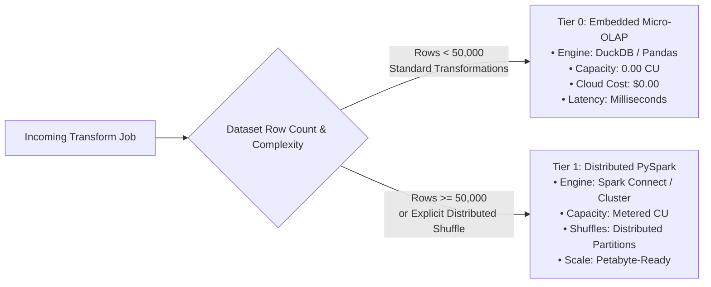
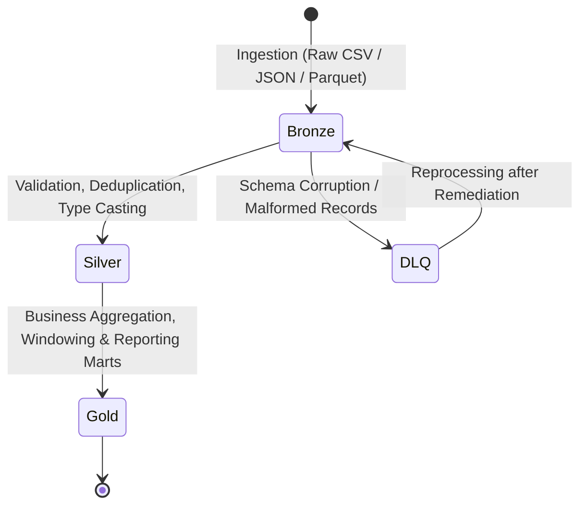

# Fabric Capacity & Data Governance — OpenFlow

OpenFlow integrates enterprise FinOps workload routing and end-to-end data governance inspired by Microsoft Fabric and modern Lakehouse standards.

---

## 1. Economic Fabric Capacity Routing (FinOps)

In modern cloud data architectures, spinning up elastic Spark clusters for small workloads generates disproportionate compute overhead, initialization latency, and cloud bills. OpenFlow eliminates this waste through **Tiered Workload Routing**:



### Capacity Unit (CU) Metering Formulation
The `CapacityMeter` (`openflow_engine.fabric_capacity`) calculates compute utilization according to runtime, dataset volume, and memory footprint:

$$\text{Capacity Units (CU)} = \max\left(0.00, \frac{\text{Rows}}{1,000,000} \times \frac{\text{Duration (s)}}{60} \times \text{Multiplier}_{\text{tier}}\right)$$

Where:
- **$\text{Multiplier}_{\text{Tier 0}} = 0.00$** (zero-charge embedded compute)
- **$\text{Multiplier}_{\text{Tier 1}} = 1.00$** (standard distributed compute)

Every transformation payload returns a structured `capacity_report`:
```json
{
  "tier_used": "TIER_0_EMBEDDED",
  "row_count": 100,
  "execution_duration_sec": 0.004,
  "capacity_units_consumed": 0.0,
  "cost_usd_estimate": 0.0,
  "finops_savings_pct": 100.0,
  "routed_reason": "Dataset size under 50k rows: optimized for 0-cost local execution."
}
```

---

## 2. Medallion Lakehouse Lifecycle

The Medallion Catalog (`openflow_engine.medallion`) orchestrates data quality progression across three formal lakehouse stages:



### Stage Responsibilities
1. **Bronze (Raw Ingestion)**:
   - Stores raw payloads without schema modification.
   - Enforces append-only or versioned snapshotting.
   - Computes deterministic SHA-256 content hashes to reject duplicate ingests.
2. **Silver (Cleaned & Curated)**:
   - Schema enforcement, null normalization, and data type casting.
   - Deduplication against composite primary keys.
   - Automatic quarantine of unparseable rows to Dead-Letter Queues (DLQ).
3. **Gold (Business Analytics)**:
   - Aggregated marts, denormalized dimension tables, and KPI metrics.
   - Written using atomic swap semantics (`if_exists="replace"`) for idempotent reads.

---

## 3. Data Governance, Privacy & Security

### A. PII Masking & Pseudonymization
The `PIIMasker` (`openflow_engine.governance`) detects and redacts sensitive data before persisting datasets to analytical tiers or logging execution traces:
- **Email Masking**: `gabriel@example.com` $\rightarrow$ `g***l@example.com`
- **Phone Number Redaction**: `+1-555-123-4567` $\rightarrow$ `+1-***-***-4567`
- **Credit Card / Identification**: Masked with fixed asterisk patterns and last 4 digits visible.
- **Deterministic Pseudonymization**: Hashes entity identifiers with a tenant salt (`HMAC-SHA256`) so that join relationships remain intact across tables while obscuring real customer identities.

### B. Cryptographic Audit Lineage
Every transformation produces a tamper-verifiable `AuditRecord` (`openflow_engine.governance`):
- **Input / Output Hashes**: Hashes input and output data matrices using SHA-256.
- **Transformation Digest**: Cryptographic signature of the transformation code and AST.
- **HMAC Manifest Signature**:
  $$\text{Signature} = \text{HMAC-SHA256}(\text{TenantKey}, \text{InputHash} \parallel \text{OutputHash} \parallel \text{CodeHash})$$
  Any post-execution alteration of data or code invalidates the audit signature.

### C. Zero-Leak Secret Masking
The `SecretMasker` intercepts execution logs, error traces, and SQL queries to sanitize passwords, cloud tokens (`AWS_SECRET_ACCESS_KEY`, `AZURE_STORAGE_KEY`), bearer tokens, and connection URIs before persisting to audit tables.

