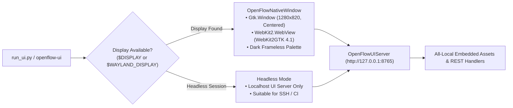

# All-Local Native Desktop Studio & Analytics Guide

OpenFlow includes a 100% all-local, air-gapped desktop studio and a multi-engine statistical plotting suite featuring **Plotly**, **Seaborn**, **Matplotlib**, and a high-performance embedded **Vector Canvas**.

---

## 1. Native Desktop Architecture (GTK3 & WebKit2GTK)

The OpenFlow UI is built to run as an authentic Linux desktop application without browser tabs, address bars, or remote server dependencies:



### Complete Air-Gap & Zero CDN Compliance
Unlike traditional web dashboards that load resources from external CDNs (such as `cdnjs`, `jsdelivr`, `tailwindcss.com`, or Google Fonts), OpenFlow embeds:
- **Zero External HTTP/HTTPS Tags**: All CSS, fonts, and scripts are embedded locally.
- **VS Code Dark+ Industrial Palette**: Pixel-perfect industrial styling (`#1e1e1e`, `#252526`, `#007acc`, `#238636`) with 0px sharp geometry and no rounded corners.
- **Zero Emojis**: Clean, professional vector SVG iconography.

---

## 2. Desktop Studio Features & Keyboard Shortcuts

| Shortcut | Action | Description |
| :--- | :--- | :--- |
| `F5` | **Execute Pipeline** | Runs the current SQL / PySpark transformation and updates preview & metrics |
| `Ctrl + Enter` | **Execute Pipeline** | Alternative key combination for running transformation |
| `Tab` | **Code Indentation** | Inserts 4 spaces instead of changing UI focus |

### Workspace Panels
1. **Activity Bar (Left)**:
   - **Explorer**: Presets (`Ecommerce Sales`, `Logistics Telemetry`, `Financial Fraud`) and Dataset metadata.
   - **Transform Editor**: Code editor with language highlighting for SQL and PySpark.
   - **Medallion Lakehouse**: One-click promotions to Bronze, Silver, and Gold with status monitoring.
   - **Analytics Suite**: Interactive data visualization selector (Plotly, Seaborn, Matplotlib, Canvas).
   - **Cloud Connectors**: Security check tools for SQL databases (PostgreSQL, SQLite) and S3 buckets.
2. **Editor & Execution Controls**:
   - Engine selector: **PySpark (Distributed)** vs **SQL / Pandas (Tier 0 Embedded)**.
   - Limit spinner: Bounds preview output rows (10, 50, 100, 500).
3. **Execution Telemetry Bar**:
   - Status badge, execution latency (ms), row count, and FinOps Capacity Usage (0.00 CU).
4. **Data Preview & Analytics Viewports**:
   - Responsive data table with alternating rows.
   - High-fidelity plot canvas rendering dynamic visualizations.

---

## 3. Multi-Engine Analytics Suite

OpenFlow provides a unified visualization endpoint (`POST /api/v1/analytics/plot`) backed by four specialized rendering engines:

### A. Plotly (`plotly`)
- **Type**: Interactive WebGL / SVG charts.
- **Features**: Dynamic pan, zoom, box-select, and hover tooltips.
- **Output**: Responsive HTML snippet or serialized JSON specification for in-app exploration.
- **Ideal For**: Deep exploratory data analysis and multidimensional scatter/line series.

### B. Seaborn (`seaborn`)
- **Type**: Statistical graphics library.
- **Features**: Kernel density estimation (KDE), regression lines, distribution histograms, and box plots.
- **Output**: High-resolution vector SVG format.
- **Ideal For**: Formal statistical distributions, variance analysis, and correlation heatmaps.

### C. Matplotlib (`matplotlib`)
- **Type**: Publication-quality plotting framework.
- **Features**: Custom industrial dark themes (`dark_background`), precise gridlines, and labeled axes.
- **Output**: Clean vector SVG or base64 raster.
- **Isolation**: Executes under `matplotlib.use("Agg")` with dedicated cache isolation (`MPLCONFIGDIR=/tmp/matplotlib_openflow`) to avoid UI thread contention.

### D. Native Vector Engine (`vector`)
- **Type**: Pure local HTML5 Canvas and SVG renderer.
- **Features**: Zero runtime dependencies; generates cubic Bezier trendlines, glowing bar caps, and distribution buckets directly in memory.
- **Ideal For**: Instant sub-millisecond previews and zero-footprint environments.

---

## 4. Launching the Studio

### Launching the Native Desktop Studio:
```bash
# Launch directly via entry point
python run_ui.py

# Or via package execution
python -m openflow_ui
```

### Launching in Headless Server Mode (Browser Access):
```bash
# Start background server on port 8765
python run_ui.py --headless --port 8765
```
Then navigate to: `http://localhost:8765`
